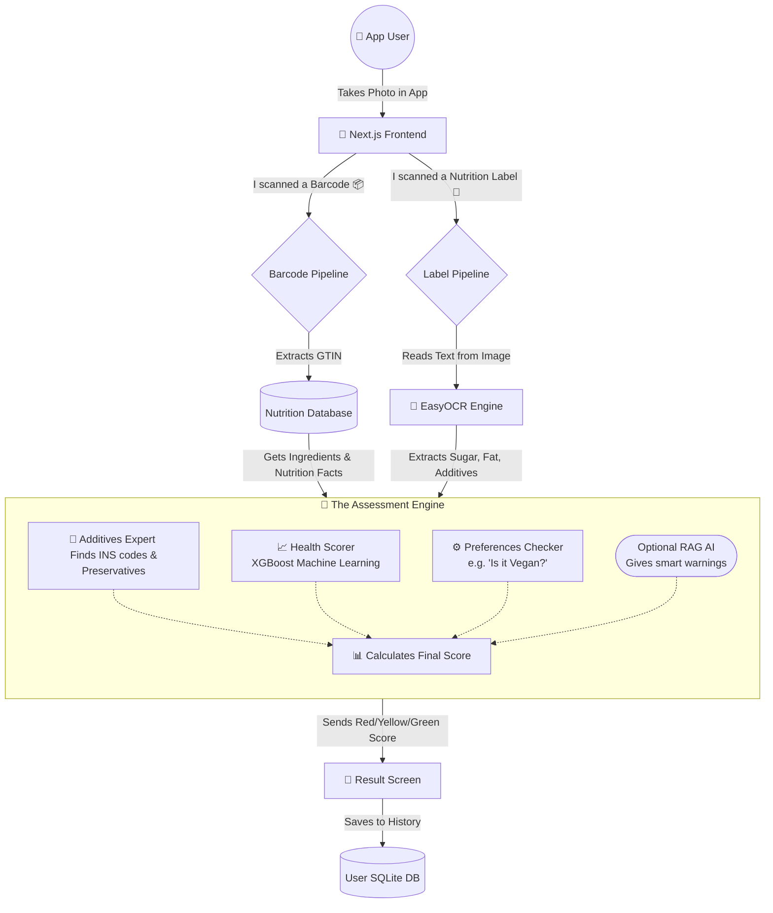

# 🍏 NutriScanner (Food Scanner App)

NutriScanner is a powerful app that helps you understand exactly what's inside your food. By scanning a product, it reveals hidden additives, calculates a personalized health score, and even warns you based on your dietary preferences (like Vegan, No Sugar, or Gluten-Free).

---

## 🛠 Tech Stack

*   **Frontend (User Interface):** Next.js (React) styled with Tailwind CSS. Hosted on Vercel.
*   **Backend (Brain):** Python Flask API. Hosted on Hugging Face Spaces.
*   **Machine Learning & Processing:**
    *   **XGBoost:** Calculates the customized Health Scores.
    *   **EasyOCR & OpenCV:** Extracts text from photos of nutrition labels.
    *   **NLP (Natural Language Processing):** Analyzes ingredient lists for harmful chemical additives and allergens.
*   **Databases:** SQLite for user accounts, scan history, and preferences.

---

## 🏗 How It Works (System Architecture)

The app uses a **Dual-Pipeline System**, meaning it can analyze a product in two different ways depending on what you scan.

### The Workflow Diagram

### 1. The Barcode Pipeline (Fast & Accurate)
When you point your camera at a barcode:
1. The app decodes the barcode line into a product number (GTIN).
2. It looks up this number in our database to instantly grab the known nutrition facts and ingredients list.
3. This exact data is sent into the Assessment Engine.

### 2. The Label Pipeline (For unlisted products)
When you photograph a physical nutrition label or ingredients list:
1. **EasyOCR** (Computer Vision) reads the tiny text on the photo.
2. Our **NLP System** cleans up the text, separating "Sugar: 10g" from the actual paragraph of ingredients.
3. This extracted data is sent into the Assessment Engine.

### 3. The Assessment Engine (The Brain)
Regardless of how the data was gathered, the Engine does four things:
1. **Additives Check:** It scans the ingredient text for hundreds of chemicals, artificial colors, and preservatives (like "Sodium Benzoate" or "INS 102"). It rates these from Safe to High-Risk.
2. **Health Scoring:** An XGBoost Machine Learning model balances the bad stuff (additives, sugar, bad fats) against the good stuff (protein) to give a score out of 10.
3. **Your Preferences:** The engine checks your profile. If you are Vegan and it found "Whey", it forces the score to RED (Harmful) and warns you.
4. **Final Output:** The app shows you a beautiful Green, Yellow, or Red score, lists exactly what additives were found, and sometimes even gives you a healthy alternative idea!
